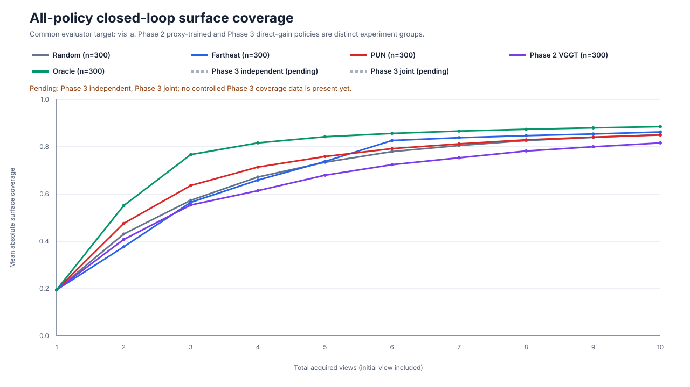
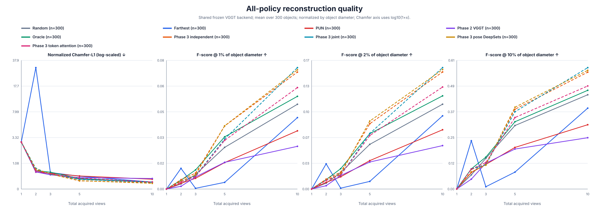
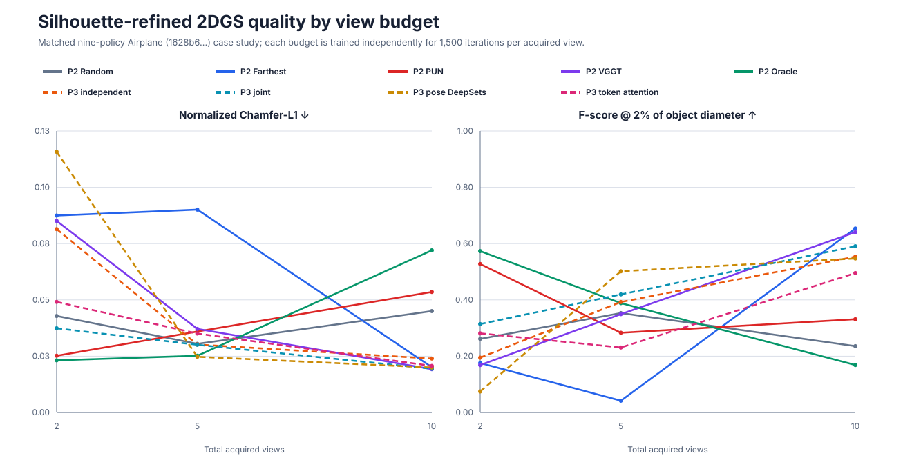
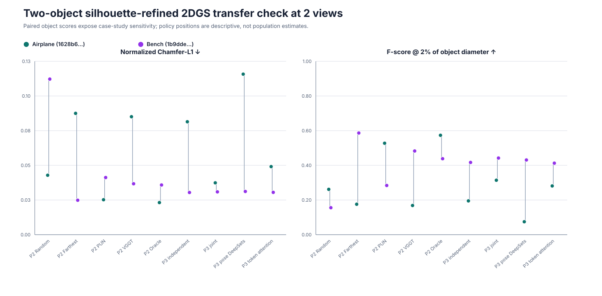

# Results Report: Direct Next-Best-View Prediction from Frozen VGGT Features

**Report date:** 2026-09-14  
**Primary evaluation seed:** 0, except the frozen Phase 1 primary sweep (seed 1)  
**Coverage target:** area-weighted rasterized visible mesh faces (`VisA`)  
**Action space:** 48 canonical PUN/NUM camera anchors  
**Status:** Phases 1–3 complete; Gaussian splatting reported as a bounded, protocol-valid case study

## Executive summary

This project asks whether frozen VGGT representations are useful for next-best-view (NBV) selection, whether their single-image proxy predictions transfer to sequential geometric coverage, and whether joint multi-view VGGT processing is better than independent processing.

The results support a deliberately qualified conclusion:

1. **H1—feature decodability is supported.** Frozen VGGT features contain NBV-relevant information. The best VGGT probe, max-pooled patch features, clearly improves over the image-independent mean map and raw RGB on ranking metrics.
2. **H2—a general VGGT advantage over generic frozen features is only partially supported.** On the primary Phase 1 test split, VGGT max-pooled patches are the best locally trained representation for normalized regret (0.2114), Spearman (0.5092), and NDCG@5 (0.8065), but not for Huber regression: ImageNet-ViT pooled patches obtain 1.0904 and DINOv2 pooled patches 1.1463, versus 1.1517 for the VGGT ranking winner. The margins over DINOv2 on ranking are small. Official PUN is stronger than every local probe on all test metrics.
3. **H3—end-to-end usefulness of the Phase 2 VGGT proxy policy is not supported.** The independent VGGT + PUN-style aggregation policy has the lowest coverage AUC (5.8206), lowest final `VisA` coverage (0.8161), worst geometric regret (0.6879), and worst final shared-VGGT Chamfer (0.3485) of the five Phase 2 policies. Better single-image ranking than the generic probes did not transfer to a better sequential policy.
4. **Direct surface-gain supervision is effective.** All Phase 3 learned policies greatly improve over Phase 2 VGGT. The best non-privileged coverage result is the expressive token-attention joint model: coverage AUC 6.8321 and final coverage 0.8674. It closes much of the gap to the one-step oracle (6.9928 and 0.8849).
5. **H4—the prespecified capacity-matched joint-processing advantage is not supported.** The matched joint model lowers fixed-history Huber error (0.00768 versus 0.00811), but the independent control is better on fixed-history ranking, closed-loop ranking, coverage, Chamfer, latency, and memory. This is a descriptive single-seed conclusion, not a significance test.
6. **The expressive joint follow-ups are promising but do not rescue the controlled H4 claim.** Pose-conditioned DeepSets gives the best final shared-VGGT reconstruction (Chamfer 0.1752). Token attention gives the best one-step ranking and best non-oracle coverage, but a worse final Chamfer (0.2232) than the independent control (0.1988). Their capacities are not matched to the independent model.
7. **`VisA` is useful but remains a proxy.** It supports cheap, deterministic precomputation and controlled per-view/cross-view comparison. However, policy order differs between coverage and reconstruction: token attention wins learned-policy coverage, while pose-conditioned DeepSets wins reconstruction. Coverage and reconstruction should therefore both remain reportable outcomes.
8. **Gaussian splatting adds a final reconstruction case study, but not a population-level policy ranking.** Under the corrected, silhouette-refined 2DGS protocol, all nine policies are matched on one airplane at 2, 5, and 10 views and on an airplane plus a bench at 2 views. The winner changes with object, budget, and metric: two-object mean Chamfer at two views favors Oracle (0.0296), while the 10-view airplane favors Phase 2 VGGT (0.0193). This instability is useful evidence that neither `VisA` nor shared-VGGT reconstruction determines 2DGS quality by itself.

## Research questions and answers

| Question or hypothesis | Answer from the completed results | Verdict |
| --- | --- | --- |
| Main question: how accurately can frozen VGGT rank unseen views by incremental coverage? | Under direct Phase 3 supervision, independent VGGT reaches regret 0.1758, Spearman 0.7066, and NDCG@5 0.8489 on 12,000 fixed histories. Token-attention joint VGGT reaches the best values: 0.1513, 0.7441, and 0.8731. | VGGT is useful for ranking when trained on the actual surface-gain target. |
| H1: is NBV-relevant information decodable from frozen VGGT? | VGGT max-pooled patches outperform mean-map and raw-RGB controls by large margins on test ranking. | **Supported.** |
| H2: does VGGT outperform generic ImageNet-ViT and DINOv2 features? | VGGT max pooling wins the local ranking metrics, but ImageNet-ViT wins Huber and DINOv2 is within 0.0017 regret and 0.0044 NDCG. | **Mixed / metric-dependent.** |
| Phase 2 / H3: does independently predicted NUM + PUN aggregation make an effective sequential VGGT policy? | Phase 2 VGGT is worse than Random, Farthest, PUN, and Oracle on coverage AUC and final coverage. | **Not supported for the evaluated adapter.** |
| Does better proxy prediction imply better geometric acquisition? | No. Phase 1’s best local ranking representation becomes Phase 2’s weakest policy after map alignment/product aggregation. | **No; the proxy-to-policy transfer fails.** |
| H4: does capacity-matched joint VGGT improve on independent history aggregation? | Joint improves Huber only. Independent wins the other prespecified prediction/ranking, coverage, reconstruction, latency, and memory outcomes. | **Not supported.** |
| Do more expressive joint heads help? | Yes for ranking and coverage. Pose DeepSets is best on reconstruction; token attention is best on ranking/coverage. | **Promising exploratory result; unequal capacity.** |
| Is PUN-style precomputed visibility suitable for per-view and cross-view comparison? | Yes. The same rasterized face cache generated all Phase 2 evaluator gains and all Phase 3 targets for 300 test objects and 51,160 histories, without policy-specific rendering. | **Methodologically successful.** |
| Is surface coverage sufficient as the only endpoint? | No. Coverage and reconstruction rankings disagree, and the reconstructor has alignment/outlier sensitivity. | **Keep both endpoints.** |
| Does the corrected Gaussian-splatting evaluation preserve the full-cohort policy ordering? | No stable ordering appears in the bounded case study. At two views Oracle has the best two-object mean 2DGS Chamfer; at 10 views on the fully evaluated airplane, Phase 2 VGGT is best. | **No; GS quality remains object-, budget-, and protocol-dependent.** |
| Does the method transfer to real imagery? | No MipNeRF360 or other real-world transfer result is present. | **Unanswered.** |

## Experimental basis and metric interpretation

The project intentionally separates three target semantics:

| Phase | Input and model target | Meaning of reported policy score | Final evaluation |
| --- | --- | --- | --- |
| Phase 1 | One image; original NUM PSNR map | Predicted source-relative NUM value; lower PSNR is more uncertain | Masked NUM regression and ranking |
| Phase 2 | Each acquired image independently; original NUM PSNR map | Aligned, filtered product of raw NUM maps, negated for higher-is-better selection | True incremental `VisA` plus shared-VGGT reconstruction |
| Phase 3 | Complete acquired history; direct incremental `VisA` gain | Predicted history-dependent surface gain | Same `VisA` rollout evaluator and shared-VGGT reconstruction |

The principal cohorts are:

| Cohort | Size | Completion |
| --- | ---: | --- |
| Phase 1 training / validation / test images | 41,760 / 5,232 / 14,400 | Complete |
| Phase 2 test objects | 300 objects, 10 total acquired views, 2,700 decisions per policy | Complete for five policies |
| Phase 3 history dataset | 34,800 train / 4,360 validation / 12,000 test histories | Complete; lengths 1, 2, 4, 6, 8 |
| Phase 3 closed-loop test | 300 objects, 10 views, 2,700 decisions per policy | Complete for all four distinct Phase 3 variants |
| Shared-VGGT reconstruction | 300 objects per policy at 1, 2, 3, 5, 10 views | Complete |
| Corrected Gaussian-splatting case study | 9 policies; 1 airplane at 2/5/10 views; airplane + bench at 2 views | Complete for the stated matched slices |

Metric directions are: Huber, normalized regret, Chamfer, accuracy distance, completeness distance, time, and memory lower is better; Spearman, NDCG@5, coverage, precision, recall, and F-score higher is better. “Accuracy” in the reconstruction tables is a distance from predicted points to ground truth, not classification accuracy. Coverage AUC and Chamfer AUC are unnormalized trapezoidal areas over acquired-view count.

All aggregate results below are means. There is one complete final seed for Phase 2 and Phase 3, so small differences must not be interpreted as statistically established effects.

## Phase 1: single-image representation probe

### Primary seed-1 validation results

The total loss is Huber plus 0.1 times pairwise ranking loss. All learned local variants use validation-selected checkpoints. Official PUN is inference-only.

| Variant | Total ↓ | Huber ↓ | Rank loss ↓ | Regret ↓ | Spearman ↑ | NDCG@5 ↑ |
| --- | ---: | ---: | ---: | ---: | ---: | ---: |
| Training mean map | 2.0347 | 1.9710 | 0.6367 | 0.2778 | 0.3875 | 0.7408 |
| Raw RGB 16×16 MLP | 1.6604 | 1.5986 | 0.6176 | 0.2615 | 0.4367 | 0.7632 |
| ImageNet-ViT pooled patch | **1.1608** | **1.1014** | 0.5941 | 0.2243 | 0.4923 | 0.7914 |
| ImageNet-ViT CLS token | 1.2116 | 1.1525 | 0.5908 | 0.2222 | 0.5036 | 0.7960 |
| DINOv2 pooled patch | 1.2271 | 1.1693 | 0.5776 | 0.2099 | 0.5257 | 0.8071 |
| DINOv2 CLS token | 1.2897 | 1.2314 | 0.5829 | 0.2130 | 0.5184 | 0.8033 |
| VGGT pooled patch | 1.3356 | 1.2757 | 0.5990 | 0.2281 | 0.4862 | 0.7898 |
| VGGT max-pooled patch | 1.3252 | 1.2675 | **0.5765** | **0.1998** | **0.5363** | **0.8162** |
| VGGT camera token | 1.3067 | 1.2478 | 0.5896 | 0.2173 | 0.5070 | 0.8008 |
| VGGT pooled registers | 1.3087 | 1.2493 | 0.5938 | 0.2203 | 0.4975 | 0.7962 |
| VGGT camera + patch | 1.2690 | 1.2105 | 0.5851 | 0.2102 | 0.5153 | 0.8062 |
| Official PUN/UPNet | **0.2134** | **0.1824** | **0.3102** | **0.0367** | **0.9165** | **0.9683** |

The bold values within the locally trained frozen-feature probes show the central tradeoff: ImageNet-ViT pooled patches are best at value regression, while VGGT max-pooled patches are best at ranking. PUN is bold separately because its released checkpoint is not training-data-controlled against this split.

### Primary seed-1 test results

| Variant | Parameters | Best epoch | Total ↓ | Huber ↓ | Rank loss ↓ | Regret ↓ | Spearman ↑ | NDCG@5 ↑ |
| --- | ---: | ---: | ---: | ---: | ---: | ---: | ---: | ---: |
| Training mean map | 0 | 0 | 1.7621 | 1.6996 | 0.6246 | 0.2592 | 0.4098 | 0.7547 |
| Raw RGB 16×16 MLP | 106,160 | 29 | 1.4905 | 1.4276 | 0.6290 | 0.2749 | 0.4016 | 0.7525 |
| ImageNet-ViT pooled patch | 106,160 | 43 | **1.1508** | **1.0904** | 0.6039 | 0.2345 | 0.4663 | 0.7821 |
| ImageNet-ViT CLS token | 106,160 | 20 | 1.2856 | 1.2243 | 0.6138 | 0.2519 | 0.4478 | 0.7709 |
| DINOv2 pooled patch | 106,160 | 32 | 1.2055 | 1.1463 | 0.5922 | 0.2130 | 0.4933 | 0.8021 |
| DINOv2 CLS token | 106,160 | 14 | 1.2887 | 1.2292 | 0.5944 | 0.2192 | 0.4924 | 0.7983 |
| VGGT pooled patch | 272,560 | 50 | 1.2107 | 1.1510 | 0.5971 | 0.2289 | 0.4769 | 0.7882 |
| VGGT max-pooled patch | 272,560 | 50 | 1.2103 | 1.1517 | **0.5856** | **0.2114** | **0.5092** | **0.8065** |
| VGGT camera token | 272,560 | 50 | 1.2120 | 1.1530 | 0.5899 | 0.2292 | 0.4951 | 0.7932 |
| VGGT pooled registers | 272,560 | 50 | 1.2105 | 1.1510 | 0.5942 | 0.2246 | 0.4864 | 0.7939 |
| VGGT camera + patch | 538,800 | 50 | 1.1708 | 1.1118 | 0.5892 | 0.2211 | 0.4977 | 0.7968 |
| Official PUN/UPNet | 21,684,144 frozen | n/a | **0.9026** | **0.8488** | **0.5377** | **0.1694** | **0.6018** | **0.8463** |

Official PUN’s unmasked test MSE is **2.7168**; its validation unmasked MSE is **0.5283**. Its validation-to-test shift is unusually large, and the released checkpoint has no machine-readable manifest proving absence of overlap with the project split. It is therefore a strong published checkpoint reference, not a strictly matched training control.

### Phase 1 interpretation

- Relative to the training mean map, VGGT max pooling improves test regret by 0.0479, Spearman by 0.0994, and NDCG@5 by 0.0517. That supports decodability.
- Relative to DINOv2 pooled patches, the VGGT ranking improvements are modest: regret improves by 0.0017, Spearman by 0.0159, and NDCG@5 by 0.0044, while Huber is 0.0055 worse.
- Max pooling is essential to the strongest VGGT claim. Mean-pooled patches are weaker than DINOv2 and do not beat ImageNet-ViT consistently.
- The raw-RGB probe does not beat the training mean on test ranking, showing that merely increasing the trainable head’s access to image content is insufficient.
- H2 should be written as “VGGT max-pooled features give the best local ranking,” not “VGGT is uniformly the best backbone.”

## Phase 2: sequential transfer of the NUM proxy

### Closed-loop coverage, ranking, and profiling

All policies use the same 300 objects, initial anchor, total budget of 10 acquired views, candidate masks, tie-breaking, and cached `VisA` evaluator. Oracle is privileged and uses evaluator-owned true gains.

| Policy | Coverage AUC ↑ | Final coverage ↑ | Final reachable ↑ | Reachable AUC ↑ | Regret ↓ | Spearman ↑ | NDCG@5 ↑ | Median policy ms ↓ | CUDA peak MB | Trainable / frozen parameters |
| --- | ---: | ---: | ---: | ---: | ---: | ---: | ---: | ---: | ---: | --- |
| Random | 6.1844 | 0.8511 | 0.9089 | 6.5908 | 0.5665 | 0.0037 | 0.5061 | 0.102 | n/a | 0 / 0 |
| Farthest | 6.2326 | 0.8623 | 0.9209 | 6.6370 | 0.4669 | 0.3898 | 0.6689 | 0.125 | n/a | 0 / 0 |
| Official PUN | 6.3801 | 0.8497 | 0.9075 | 6.7972 | 0.5500 | 0.1859 | 0.5282 | 9.982 | 102.6 | 0 / 21,684,144 |
| Phase 2 VGGT | 5.8206 | 0.8161 | 0.8716 | 6.2000 | 0.6879 | 0.0376 | 0.4395 | 2.120 | 97.7 | 272,560 / not recorded |
| Oracle | **6.9928** | **0.8849** | **0.9459** | **7.4570** | **0.0000** | **1.0000** | **0.9963** | **0.004** | n/a | 0 / 0 |

The mean reachable ceiling is 0.9321 for every policy. Regret and NDCG have 2,700 valid decisions per policy. Spearman has 2,699 valid Random states, 2,698 VGGT states, 2,690 Oracle states, and 2,700 for Farthest/PUN because constant-gain states are undefined.

Peak process RSS is 1,331,425,280 bytes for every Phase 2 profile. The measured RSS deltas are 139,264 bytes for Random, 0 for Farthest, 220,954,624 for PUN, 409,600 for VGGT, and 0 for Oracle. Random, Farthest, and Oracle use analytic CPU timing; PUN uses incremental live model inference; VGGT uses cached features plus its live head, so the latency columns describe different intended policy paths.

PUN has the best non-oracle early-to-mid-budget coverage AUC, but Farthest has the best non-oracle final coverage. Phase 2 VGGT is unambiguously weakest. Its failure can arise in the source-relative map alignment, the per-map `small` filter/product aggregation, mismatch between NUM PSNR and actual marginal surface gain, or interactions among these—not from an absence of single-image signal alone.

### Coverage by acquired-view count

| Policy | 1 | 2 | 3 | 4 | 5 | 6 | 7 | 8 | 9 | 10 |
| --- | ---: | ---: | ---: | ---: | ---: | ---: | ---: | ---: | ---: | ---: |
| Random | 0.1953 | 0.4309 | 0.5736 | 0.6719 | 0.7343 | 0.7795 | 0.8052 | 0.8263 | 0.8396 | 0.8511 |
| Farthest | 0.1953 | 0.3768 | 0.5649 | 0.6590 | 0.7375 | 0.8264 | 0.8382 | 0.8469 | 0.8540 | 0.8623 |
| PUN | 0.1953 | 0.4757 | 0.6361 | 0.7141 | 0.7585 | 0.7919 | 0.8116 | 0.8289 | 0.8408 | 0.8497 |
| VGGT proxy policy | 0.1953 | 0.4079 | 0.5537 | 0.6143 | 0.6795 | 0.7242 | 0.7532 | 0.7820 | 0.8000 | 0.8161 |
| Oracle | 0.1953 | 0.5512 | 0.7668 | 0.8163 | 0.8423 | 0.8563 | 0.8662 | 0.8737 | 0.8798 | 0.8849 |

### Reachable-normalized coverage by acquired-view count

| Policy | 1 | 2 | 3 | 4 | 5 | 6 | 7 | 8 | 9 | 10 |
| --- | ---: | ---: | ---: | ---: | ---: | ---: | ---: | ---: | ---: | ---: |
| Random | 0.2043 | 0.4568 | 0.6107 | 0.7154 | 0.7826 | 0.8312 | 0.8592 | 0.8820 | 0.8964 | 0.9089 |
| Farthest | 0.2043 | 0.3956 | 0.5990 | 0.7011 | 0.7867 | 0.8817 | 0.8946 | 0.9040 | 0.9118 | 0.9209 |
| PUN | 0.2043 | 0.5042 | 0.6756 | 0.7598 | 0.8085 | 0.8446 | 0.8659 | 0.8849 | 0.8978 | 0.9075 |
| VGGT proxy policy | 0.2043 | 0.4313 | 0.5886 | 0.6538 | 0.7241 | 0.7722 | 0.8035 | 0.8346 | 0.8541 | 0.8716 |
| Oracle | 0.2043 | 0.5837 | 0.8170 | 0.8703 | 0.8986 | 0.9140 | 0.9249 | 0.9333 | 0.9401 | 0.9459 |

### Shared-VGGT reconstruction by view count

All rows contain 300 objects. `Acc.` and `Comp.` are normalized one-sided point distances. `P`, `R`, and `F` are precision, recall, and F-score at 1% or 2% of ground-truth diameter.

| Policy | Views | Acc. ↓ | Comp. ↓ | Chamfer ↓ | P@1 ↑ | R@1 ↑ | F@1 ↑ | P@2 ↑ | R@2 ↑ | F@2 ↑ |
| --- | ---: | ---: | ---: | ---: | ---: | ---: | ---: | ---: | ---: | ---: |
| Random | 1 | 2.6650 | 2.9568 | 2.8109 | 0.0000 | 0.0000 | 0.0000 | 0.0000 | 0.0000 | 0.0000 |
| Random | 2 | 0.5727 | 0.7793 | 0.6760 | 0.0260 | 0.0017 | 0.0032 | 0.0543 | 0.0042 | 0.0076 |
| Random | 3 | 0.4576 | 0.6372 | 0.5474 | 0.0437 | 0.0053 | 0.0091 | 0.0996 | 0.0124 | 0.0214 |
| Random | 5 | 0.2513 | 0.3903 | 0.3208 | 0.0832 | 0.0162 | 0.0261 | 0.1831 | 0.0360 | 0.0576 |
| Random | 10 | 0.1677 | 0.2688 | 0.2183 | 0.1086 | 0.0367 | 0.0531 | 0.2360 | 0.0751 | 0.1094 |
| Farthest | 1 | 2.6650 | 2.9568 | 2.8109 | 0.0000 | 0.0000 | 0.0000 | 0.0000 | 0.0000 | 0.0000 |
| Farthest | 2 | 30.6909 | 30.5244 | 30.6076 | 0.0815 | 0.0072 | 0.0129 | 0.1906 | 0.0184 | 0.0325 |
| Farthest | 3 | 0.4855 | 0.7117 | 0.5986 | 0.0018 | 0.0003 | 0.0005 | 0.0044 | 0.0007 | 0.0011 |
| Farthest | 5 | 0.3291 | 0.5501 | 0.4396 | 0.0397 | 0.0024 | 0.0042 | 0.0908 | 0.0056 | 0.0099 |
| Farthest | 10 | 0.1639 | 0.2754 | 0.2197 | 0.0942 | 0.0309 | 0.0447 | 0.2143 | 0.0642 | 0.0944 |
| PUN | 1 | 2.6650 | 2.9568 | 2.8109 | 0.0000 | 0.0000 | 0.0000 | 0.0000 | 0.0000 | 0.0000 |
| PUN | 2 | 0.5078 | 0.7232 | 0.6155 | 0.0282 | 0.0020 | 0.0036 | 0.0652 | 0.0048 | 0.0086 |
| PUN | 3 | 0.4692 | 0.6554 | 0.5623 | 0.0274 | 0.0040 | 0.0067 | 0.0639 | 0.0094 | 0.0158 |
| PUN | 5 | 0.3714 | 0.5276 | 0.4495 | 0.0563 | 0.0103 | 0.0166 | 0.1235 | 0.0230 | 0.0367 |
| PUN | 10 | 0.2587 | 0.3843 | 0.3215 | 0.0793 | 0.0250 | 0.0365 | 0.1769 | 0.0516 | 0.0764 |
| VGGT proxy policy | 1 | 2.6650 | 2.9568 | 2.8109 | 0.0000 | 0.0000 | 0.0000 | 0.0000 | 0.0000 | 0.0000 |
| VGGT proxy policy | 2 | 0.4968 | 0.7591 | 0.6280 | 0.0195 | 0.0009 | 0.0017 | 0.0467 | 0.0023 | 0.0043 |
| VGGT proxy policy | 3 | 0.4011 | 0.5960 | 0.4985 | 0.0385 | 0.0044 | 0.0076 | 0.0880 | 0.0102 | 0.0175 |
| VGGT proxy policy | 5 | 0.2973 | 0.4647 | 0.3810 | 0.0583 | 0.0102 | 0.0167 | 0.1235 | 0.0213 | 0.0348 |
| VGGT proxy policy | 10 | 0.2746 | 0.4223 | 0.3485 | 0.0624 | 0.0179 | 0.0268 | 0.1387 | 0.0373 | 0.0560 |
| Oracle | 1 | 2.6650 | 2.9568 | 2.8109 | 0.0000 | 0.0000 | 0.0000 | 0.0000 | 0.0000 | 0.0000 |
| Oracle | 2 | 0.5960 | 0.7782 | 0.6871 | 0.0281 | 0.0032 | 0.0055 | 0.0607 | 0.0071 | 0.0121 |
| Oracle | 3 | 0.5380 | 0.6935 | 0.6157 | 0.0436 | 0.0071 | 0.0120 | 0.0951 | 0.0157 | 0.0262 |
| Oracle | 5 | 0.2880 | 0.4086 | 0.3483 | 0.0819 | 0.0213 | 0.0327 | 0.1846 | 0.0463 | 0.0714 |
| Oracle | 10 | 0.1716 | 0.2643 | **0.2179** | 0.1145 | 0.0408 | **0.0581** | 0.2544 | 0.0826 | **0.1201** |

Final Chamfer AUC values are Random 4.5709, Farthest 34.9986, PUN 5.2413, VGGT 4.9858, and Oracle 4.7799. The Farthest AUC is dominated by its catastrophic two-view value of 30.6076 and should be treated as an alignment/outlier diagnostic, not as evidence that Farthest intrinsically reconstructs poorly. More generally, the non-monotonic curves show that the frozen-VGGT reconstruction backend and its Sim(3) camera alignment are sensitive to history composition.

### Phase 2 answer

Replacing PUN’s visual representation with the validation-selected frozen-VGGT NUM probe did **not** improve sequential acquisition. PUN is substantially better at early view budgets and in coverage AUC; Farthest is better at the final budget; even seeded Random beats Phase 2 VGGT throughout most of the rollout. H3 is therefore rejected for this specific independent-prediction and PUN-product-aggregation implementation.

## Phase 3: direct history-dependent surface gain

### Validation-selected training outcomes

| Variant | Architecture | Trainable parameters | Best epoch / completed | Val total ↓ | Val Huber ↓ | Val rank loss ↓ | Val regret ↓ | Val Spearman ↑ | Val NDCG@5 ↑ |
| --- | --- | ---: | --- | ---: | ---: | ---: | ---: | ---: | ---: |
| Independent control | Independent one-image VGGT; masked mean | 272,950 | 41 / 51 | 0.05249 | 0.00870 | 0.43787 | 0.15137 | 0.75499 | 0.86905 |
| Capacity-matched joint | Joint VGGT; max-pool per view then masked mean | 272,950 | 40 / 50 | 0.05349 | **0.00802** | 0.45471 | 0.16232 | 0.72744 | 0.85692 |
| Joint pose DeepSets | Pose-conditioned per-view element encoder | 289,718 | 28 / 38 | 0.05070 | 0.00948 | 0.41221 | 0.13496 | 0.77771 | 0.88621 |
| Joint token attention | 2×2 spatial tokens; 48 candidate queries | 350,209 | 48 / 58 | **0.05036** | 0.00943 | **0.40930** | **0.12733** | **0.79129** | **0.89351** |

All four use the frozen 909,112,320-parameter VGGT backbone reference, the same direct `VisA` supervision, object split, optimizer family, effective batch size, and validation protocol. Only the first two are capacity matched, so the two expressive rows are diagnostic follow-ups.

### Fixed-history test results: all distinct Phase 3 variants

Each row contains the same 12,000 held-out histories.

| Variant | Huber ↓ | Regret ↓ | Spearman ↑ | NDCG@5 ↑ |
| --- | ---: | ---: | ---: | ---: |
| Independent control | 0.008110 | 0.175766 | 0.706572 | 0.848879 |
| Capacity-matched joint | **0.007683** | 0.198544 | 0.661221 | 0.826619 |
| Joint pose DeepSets | 0.008858 | 0.161828 | 0.719609 | 0.861223 |
| Joint token attention | 0.008938 | **0.151308** | **0.744132** | **0.873130** |

The matched joint model is better only on Huber. The expressive models deliberately accept worse absolute regression in exchange for better action ranking, and token attention is the strongest ranker.

### Fixed-history results by history length

Each row contains 2,400 test histories.

| Variant | Length | Huber ↓ | Regret ↓ | Spearman ↑ | NDCG@5 ↑ |
| --- | ---: | ---: | ---: | ---: | ---: |
| Independent | 1 | 0.012780 | 0.073523 | 0.836511 | 0.939873 |
| Matched joint | 1 | **0.010142** | 0.067935 | 0.843796 | 0.945785 |
| Pose DeepSets | 1 | 0.010874 | **0.055608** | **0.867413** | **0.953375** |
| Token attention | 1 | 0.010200 | 0.068432 | 0.858232 | 0.947920 |
| Independent | 2 | 0.009595 | 0.080452 | 0.818677 | 0.929656 |
| Matched joint | 2 | **0.009282** | 0.093973 | 0.789328 | 0.913126 |
| Pose DeepSets | 2 | 0.010681 | 0.076916 | 0.839053 | 0.933704 |
| Token attention | 2 | 0.010586 | **0.074793** | **0.849265** | **0.936303** |
| Independent | 4 | **0.007058** | 0.153125 | 0.724531 | 0.864573 |
| Matched joint | 4 | 0.007523 | 0.174609 | 0.682690 | 0.842668 |
| Pose DeepSets | 4 | 0.008996 | 0.130659 | 0.759287 | 0.886986 |
| Token attention | 4 | 0.009508 | **0.122516** | **0.781345** | **0.895564** |
| Independent | 6 | **0.005894** | 0.244765 | 0.622988 | 0.787419 |
| Matched joint | 6 | 0.006155 | 0.285350 | 0.547672 | 0.750530 |
| Pose DeepSets | 6 | 0.007393 | 0.235402 | 0.619707 | 0.799021 |
| Token attention | 6 | 0.007805 | **0.212329** | **0.664980** | **0.821856** |
| Independent | 8 | **0.005224** | 0.326966 | 0.530156 | 0.722875 |
| Matched joint | 8 | 0.005312 | 0.370853 | 0.442619 | 0.680983 |
| Pose DeepSets | 8 | 0.006347 | 0.310557 | 0.512588 | 0.733032 |
| Token attention | 8 | 0.006588 | **0.278468** | **0.566837** | **0.764005** |

Lower Huber at longer histories partly reflects smaller remaining surface gains, while regret rises and ranking correlations fall as useful candidates become harder to distinguish. The matched joint model helps at length 1 but falls behind the independent control from length 2 onward on ranking. Token attention’s advantage becomes especially clear at lengths 4–8, supporting the idea that preserving spatial tokens and candidate-conditioned queries is more useful than simply allowing cross-view interaction inside VGGT.

### Closed-loop results: all distinct Phase 3 variants

| Variant | Coverage AUC ↑ | Final coverage ↑ | Final reachable ↑ | Reachable AUC ↑ | Regret ↓ | Spearman ↑ | NDCG@5 ↑ | Final Chamfer ↓ | Chamfer AUC ↓ | Final F@10 ↑ |
| --- | ---: | ---: | ---: | ---: | ---: | ---: | ---: | ---: | ---: | ---: |
| Independent | 6.7834 | 0.8640 | 0.9229 | 7.2312 | 0.4038 | 0.3731 | 0.6677 | 0.1988 | **4.3564** | 0.5583 |
| Matched joint | 6.7537 | 0.8623 | 0.9210 | 7.1995 | 0.4175 | 0.3368 | 0.6514 | 0.2113 | 4.6216 | **0.5800** |
| Pose DeepSets | 6.8162 | 0.8648 | 0.9236 | 7.2663 | 0.3857 | 0.3702 | 0.6740 | **0.1752** | 4.3619 | 0.5670 |
| Token attention | **6.8321** | **0.8674** | **0.9266** | **7.2838** | **0.3537** | **0.4161** | **0.7017** | 0.2232 | 4.7220 | 0.4924 |

All rows contain 300 objects, 2,700 regret/NDCG decisions, and 2,699, 2,699, 2,699, and 2,695 valid Spearman states respectively. The token model is best for action ranking and coverage, while Pose DeepSets is best for final geometric reconstruction. The matched joint model’s slightly higher F@10 does not compensate for its worse Chamfer, ranking, coverage, and computational cost.

### Phase 3 coverage by acquired-view count

| Variant | 1 | 2 | 3 | 4 | 5 | 6 | 7 | 8 | 9 | 10 |
| --- | ---: | ---: | ---: | ---: | ---: | ---: | ---: | ---: | ---: | ---: |
| Independent | 0.1953 | 0.5232 | 0.7420 | 0.7868 | 0.8173 | 0.8315 | 0.8427 | 0.8519 | 0.8583 | 0.8640 |
| Matched joint | 0.1953 | 0.5223 | 0.7339 | 0.7793 | 0.8128 | 0.8292 | 0.8410 | 0.8498 | 0.8566 | 0.8623 |
| Pose DeepSets | 0.1953 | 0.5264 | 0.7452 | 0.7922 | 0.8240 | 0.8377 | 0.8469 | 0.8541 | 0.8596 | 0.8648 |
| Token attention | 0.1953 | 0.5196 | 0.7466 | 0.7969 | 0.8275 | 0.8407 | 0.8497 | 0.8570 | 0.8627 | 0.8674 |

### Phase 3 reachable-normalized coverage by acquired-view count

| Variant | 1 | 2 | 3 | 4 | 5 | 6 | 7 | 8 | 9 | 10 |
| --- | ---: | ---: | ---: | ---: | ---: | ---: | ---: | ---: | ---: | ---: |
| Independent | 0.2043 | 0.5540 | 0.7902 | 0.8387 | 0.8719 | 0.8872 | 0.8995 | 0.9096 | 0.9165 | 0.9229 |
| Matched joint | 0.2043 | 0.5530 | 0.7819 | 0.8309 | 0.8669 | 0.8847 | 0.8975 | 0.9072 | 0.9148 | 0.9210 |
| Pose DeepSets | 0.2043 | 0.5575 | 0.7938 | 0.8444 | 0.8790 | 0.8939 | 0.9040 | 0.9119 | 0.9179 | 0.9236 |
| Token attention | 0.2043 | 0.5497 | 0.7954 | 0.8498 | 0.8829 | 0.8972 | 0.9070 | 0.9150 | 0.9214 | 0.9266 |

### Phase 3 shared-VGGT reconstruction: all metrics and view counts

`P/R/F@10` is included because the Phase 3 result schema records the additional 10%-diameter threshold. All rows contain 300 objects.

| Variant | Views | Acc. ↓ | Comp. ↓ | Chamfer ↓ | P/R/F@1 ↑ | P/R/F@2 ↑ | P/R/F@10 ↑ |
| --- | ---: | ---: | ---: | ---: | --- | --- | --- |
| Independent | 1 | 2.6650 | 2.9568 | 2.8109 | 0 / 0 / 0 | 0 / 0 / 0 | 0.0017 / 0.0001 / 0.0002 |
| Independent | 2 | 0.6547 | 0.8265 | 0.7406 | 0.0309 / 0.0034 / 0.0059 | 0.0699 / 0.0074 / 0.0127 | 0.2413 / 0.0631 / 0.0937 |
| Independent | 3 | 0.4505 | 0.6127 | 0.5316 | 0.0323 / 0.0062 / 0.0100 | 0.0714 / 0.0135 / 0.0217 | 0.2282 / 0.0873 / 0.1182 |
| Independent | 5 | 0.2097 | 0.3137 | 0.2617 | 0.0979 / 0.0256 / 0.0395 | 0.2173 / 0.0547 / 0.0842 | 0.5791 / 0.3034 / 0.3812 |
| Independent | 10 | 0.1642 | 0.2335 | 0.1988 | 0.1292 / 0.0529 / 0.0733 | 0.2857 / 0.1060 / 0.1510 | 0.7088 / 0.4746 / 0.5583 |
| Matched joint | 1 | 2.6650 | 2.9568 | 2.8109 | 0 / 0 / 0 | 0 / 0 / 0 | 0.0017 / 0.0001 / 0.0002 |
| Matched joint | 2 | 0.7132 | 0.8920 | 0.8026 | 0.0322 / 0.0029 / 0.0051 | 0.0716 / 0.0067 / 0.0115 | 0.2672 / 0.0637 / 0.0952 |
| Matched joint | 3 | 0.4409 | 0.6008 | 0.5208 | 0.0308 / 0.0050 / 0.0082 | 0.0679 / 0.0110 / 0.0179 | 0.2397 / 0.0848 / 0.1161 |
| Matched joint | 5 | 0.2641 | 0.3668 | 0.3155 | 0.0803 / 0.0201 / 0.0314 | 0.1853 / 0.0463 / 0.0717 | 0.5598 / 0.2921 / 0.3692 |
| Matched joint | 10 | 0.1762 | 0.2464 | 0.2113 | 0.1335 / 0.0550 / 0.0760 | 0.2978 / 0.1103 / 0.1565 | 0.7355 / 0.4945 / 0.5800 |
| Pose DeepSets | 1 | 2.6650 | 2.9568 | 2.8109 | 0 / 0 / 0 | 0 / 0 / 0 | 0.0017 / 0.0001 / 0.0002 |
| Pose DeepSets | 2 | 0.6724 | 0.8499 | 0.7611 | 0.0326 / 0.0028 / 0.0050 | 0.0740 / 0.0066 / 0.0114 | 0.2405 / 0.0545 / 0.0820 |
| Pose DeepSets | 3 | 0.4648 | 0.6206 | 0.5427 | 0.0268 / 0.0055 / 0.0088 | 0.0622 / 0.0121 / 0.0194 | 0.2158 / 0.0839 / 0.1141 |
| Pose DeepSets | 5 | 0.2166 | 0.3224 | 0.2695 | 0.0973 / 0.0257 / 0.0396 | 0.2180 / 0.0570 / 0.0876 | 0.5804 / 0.3116 / 0.3908 |
| Pose DeepSets | 10 | **0.1397** | **0.2107** | **0.1752** | 0.1317 / 0.0540 / 0.0747 | 0.2869 / 0.1096 / 0.1541 | 0.7243 / 0.4834 / 0.5670 |
| Token attention | 1 | 2.6650 | 2.9568 | 2.8109 | 0 / 0 / 0 | 0 / 0 / 0 | 0.0017 / 0.0001 / 0.0002 |
| Token attention | 2 | 0.5831 | 0.7606 | 0.6718 | 0.0281 / 0.0024 / 0.0044 | 0.0669 / 0.0062 / 0.0110 | 0.2469 / 0.0619 / 0.0951 |
| Token attention | 3 | 0.4608 | 0.6161 | 0.5384 | 0.0305 / 0.0046 / 0.0078 | 0.0691 / 0.0108 / 0.0181 | 0.2528 / 0.0925 / 0.1270 |
| Token attention | 5 | 0.3098 | 0.4211 | 0.3654 | 0.0757 / 0.0198 / 0.0305 | 0.1738 / 0.0451 / 0.0690 | 0.5031 / 0.2748 / 0.3416 |
| Token attention | 10 | 0.1799 | 0.2665 | 0.2232 | 0.1155 / 0.0452 / 0.0635 | 0.2546 / 0.0918 / 0.1315 | 0.6480 / 0.4115 / 0.4924 |

### Runtime, memory, and capacity

| Variant | Scoring mode | Median closed-loop ms ↓ | Peak CUDA GB ↓ | Peak process RSS GB | Trainable parameters |
| --- | --- | ---: | ---: | ---: | ---: |
| Independent | Cached one-image features + live history head | 1.691 | 3.649 | 5.306 | 272,950 |
| Matched joint | Live complete-history VGGT + head | 244.165 | 4.497 | 5.306 | 272,950 |
| Pose DeepSets | Live complete-history VGGT + head | 244.721 | 4.497 | 5.305 | 289,718 |
| Token attention | Live complete-history VGGT + head | 244.261 | 4.497 | 6.404 | 350,209 |

The timing comparison represents intended deployment paths, not equal cache conditions: independent scoring reuses per-image features, while joint scoring reruns frozen VGGT on the complete history. Joint scoring is roughly 140–160 times slower in these runs and uses about 0.85 GB more peak CUDA allocation. One-step cached-head timings deliberately exclude joint feature materialization and are not substitutes for closed-loop live latency.

Peak process RSS deltas are 1.06 MB for the independent control in the matched run, 76.69 MB for matched joint, 75.81 MB for Pose DeepSets, and 2.47 MB for token attention. Cached one-step evaluation over 12,000 samples takes 10.185/5.705 seconds for independent/matched-joint, 9.516/5.791 seconds in the independent/Pose run, and 9.422/7.155 seconds in the independent/token run; those joint numbers exclude feature creation. The retained training-time joint-feature materialization records 19.27 seconds and 1.197 GB of train tensors for matched joint, 19.05 seconds and 1.197 GB for Pose DeepSets, and 276.97 seconds and 4.789 GB for token attention. Resumed test-cache restoration durations are explicitly not valid live-backbone timing measurements.

### Phase 3 answer

The controlled evidence does not support H4: merely moving interaction inside frozen VGGT and then aggressively max/mean pooling does not improve view ranking or acquisition. The follow-ups show a more useful architectural lesson. Joint features can help when the head preserves either feature–pose association or spatial tokens and scores candidates explicitly. That lesson remains exploratory because parameter counts differ and only seed 0 has a complete full-cohort comparison.

## Cross-phase synthesis

*Figure 1. Absolute `VisA` coverage for all five Phase 2 policies and all four distinct Phase 3 policies on the same 300-object test cohort.*

*Figure 2. Shared frozen-VGGT reconstruction metrics at 1, 2, 3, 5, and 10 views. The log-transformed Chamfer display retains the Farthest two-view alignment outlier.*

### Complete policy ordering

| Policy | Supervision | Final coverage ↑ | Coverage AUC ↑ | Final Chamfer ↓ | Interpretation |
| --- | --- | ---: | ---: | ---: | --- |
| Oracle | True evaluator gain at selection | **0.8849** | **6.9928** | 0.2179 | Privileged one-step upper reference |
| Phase 3 token attention | Direct history `VisA` | **0.8674** | **6.8321** | 0.2232 | Best learned coverage/ranking |
| Phase 3 pose DeepSets | Direct history `VisA` | 0.8648 | 6.8162 | **0.1752** | Best reconstruction |
| Phase 3 independent | Direct history `VisA` | 0.8640 | 6.7834 | 0.1988 | Best controlled cost/performance balance |
| Farthest | Camera geometry | 0.8623 | 6.2326 | 0.2197 | Strong cheap final-budget baseline |
| Phase 3 matched joint | Direct history `VisA` | 0.8623 | 6.7537 | 0.2113 | Does not beat independent control |
| Random | None | 0.8511 | 6.1844 | 0.2183 | Seeded baseline |
| Official PUN | Single-image NUM PSNR | 0.8497 | 6.3801 | 0.3215 | Strong early coverage, weak final reconstruction |
| Phase 2 VGGT proxy policy | Single-image NUM PSNR | 0.8161 | 5.8206 | 0.3485 | Proxy/aggregation transfer failure |

This ordering provides the project’s main narrative:

- Frozen features do contain useful information, but feature-probe success is not sufficient for sequential-policy success.
- Directly matching the learning target to the evaluator yields the largest practical gain.
- Independent processing remains the strongest controlled baseline once latency and memory are considered.
- More expressive joint heads can improve the quality frontier, but coverage and reconstruction reward different histories.

### What the PUN-style visibility note contributed

The paper note proposed using the PUN visibility calculation as a precomputable target for per-view and cross-view comparison. The implementation follows that intent through rasterized, occlusion-aware mesh-face visibility. `VisA` weights each visible face by area, unions face masks across acquired views, and computes a candidate’s marginal gain from faces not already seen.

This choice was successful in three ways:

1. It generated a common evaluator for every policy without exposing geometry to learned models.
2. It generated deterministic direct targets for 51,160 Phase 3 histories without running a reconstruction method per training sample.
3. It made one-step and closed-loop comparisons exactly consistent: selected gain equals the explicit coverage difference after acquisition.

Its limitation is equally important: visible face area is not reconstructed surface quality. The divergence between token-attention coverage and Pose-DeepSets reconstruction is direct evidence that `VisA` should be treated as a strong backend-independent proxy, not the final reconstruction objective.

## Gaussian-splatting reconstruction case study

The final GS analysis uses only the latest **silhouette-refined 2DGS protocol** (`acquired_rendered_silhouette_sim3_v2`) and corrected CPU median-depth extraction. The older `gaussian_splatting_variant_comparison` measurements are superseded because their RGB blue channel was interpreted as depth; they are excluded from every table, figure, and conclusion here. The corrected original-placement rows are also excluded so that a policy comparison never mixes alignment protocols.

Each view budget is trained independently with 1,500 optimization iterations per acquired view: 3,000 iterations at two views, 7,500 at five, and 15,000 at ten. Placement fitting uses only acquired-view RGB silhouettes and known NUM cameras; ground-truth geometry is used after fitting for evaluation. One-view histories are excluded because the repair protocol treats their depth and scale as underconstrained. The associated 3DGS outputs remain qualitative and do not enter geometric tables.

### Matched evaluation slices

The aggregate contains 39 corrected 2DGS rows. Two balanced slices are used for inference:

- **View-budget slice:** all nine policies on airplane `02691156/1628…` at 2, 5, and 10 views (27 rows).
- **Object-transfer slice:** all nine policies on that airplane and bench `02828884/1b9d…` at two views (18 rows).

The three additional bench rows at 5 or 10 views are valid artifacts but are omitted from aggregate comparisons because the other policies are not present at the same object/budget. This is a complete case study for the stated slices, not an estimate over the 300-object test population.

*Figure 3. Matched airplane 2DGS results across independently trained 2-, 5-, and 10-view budgets. Phase 2 policies are solid and Phase 3 policies dashed. More views and more optimization do not guarantee monotonic improvement for every acquired history.*

*Figure 4. Paired airplane/bench scores at two views. The within-policy spread shows why this two-object slice should be read as a transfer check rather than a dataset-wide ranking.*

### Two-object result at two views

These are means over the matched airplane and bench; the graph above retains both individual object scores.

| Policy | Chamfer ↓ | F@1 ↑ | F@2 ↑ | F@10 ↑ |
| --- | ---: | ---: | ---: | ---: |
| Random | 0.0777 | 0.0975 | 0.2086 | 0.7073 |
| Farthest | 0.0563 | 0.2398 | 0.3810 | 0.8238 |
| PUN | 0.0333 | 0.2223 | 0.4057 | 0.9260 |
| Phase 2 VGGT | 0.0610 | 0.1835 | 0.3256 | 0.8138 |
| Oracle | **0.0296** | **0.2931** | **0.5058** | 0.9448 |
| Phase 3 independent | 0.0560 | 0.1708 | 0.3058 | 0.8061 |
| Phase 3 matched joint | 0.0342 | 0.1967 | 0.3781 | **0.9472** |
| Phase 3 pose DeepSets | 0.0736 | 0.1030 | 0.2527 | 0.7022 |
| Phase 3 token attention | 0.0399 | 0.1915 | 0.3468 | 0.9161 |

Oracle is strongest at this sparse budget on Chamfer and the strict F-scores, but this does not establish a general oracle reconstruction advantage: the selected history optimizes `VisA`, not 2DGS, and the cohort contains only two objects. Among learned Phase 3 policies, matched joint has the best two-object mean Chamfer (0.0342), while token attention is second (0.0399); their full-cohort shared-VGGT ordering is different.

### Ten-view airplane endpoint

| Policy | Chamfer ↓ | F@1 ↑ | F@2 ↑ | F@10 ↑ |
| --- | ---: | ---: | ---: | ---: |
| Random | 0.0451 | 0.1242 | 0.2356 | 0.9365 |
| Farthest | 0.0202 | **0.3438** | **0.6537** | 0.9704 |
| PUN | 0.0536 | 0.1597 | 0.3314 | 0.8143 |
| Phase 2 VGGT | **0.0193** | 0.3417 | 0.6407 | 0.9807 |
| Oracle | 0.0722 | 0.0866 | 0.1685 | 0.6213 |
| Phase 3 independent | 0.0240 | 0.2867 | 0.5536 | 0.9798 |
| Phase 3 matched joint | 0.0195 | 0.2841 | 0.5906 | 0.9998 |
| Phase 3 pose DeepSets | 0.0200 | 0.2703 | 0.5471 | 0.9997 |
| Phase 3 token attention | 0.0207 | 0.2071 | 0.4953 | **0.9999** |

At this endpoint, Phase 2 VGGT has the best Chamfer, Farthest the best F@1/F@2, and token attention the best F@10. The four strongest Chamfer values—Phase 2 VGGT, matched joint, pose DeepSets, and Farthest—lie within 0.0009. Oracle and PUN are substantially worse despite their strong early/full-cohort coverage results. Taken with the two-object slice, this supports a narrow but useful conclusion: **the acquired history affects GS reconstruction, but the existing coverage and shared-VGGT rankings do not transfer as a stable 2DGS ordering.**

## Limitations and validity threats

1. **Single final seed.** Phase 2 and all full Phase 3 comparisons use seed 0. The descriptive ordering is reproducible from saved artifacts but has no across-seed uncertainty estimate.
2. **PUN overlap is unknown.** The official release has no sample manifest, so training overlap with the project’s validation/test objects cannot be ruled out.
3. **Phase 2 adapter differs from official action sampling.** Official PUN’s fresh 512-candidate sampling is replaced by the project’s fixed 48 anchors and common mask. Empty-filter behavior is deterministic.
4. **Proxy mismatch.** NUM PSNR values are not direct surface gains. Phase 2 is specifically a transfer test, and its negative result should not be presented as evidence that VGGT lacks geometry.
5. **Visibility fidelity.** The PUN camera convention and pole rolls are pinned; non-pole anchors match the reference. Bounding-box centering was validated on six objects, but exact original-OBJ equivalence and full-dataset RGB registration are not claimed.
6. **Reconstruction coupling.** VGGT is both a representation family and the shared reconstruction backend. `VisA` is retained to provide a backend-independent counterpart.
7. **Reconstruction alignment sensitivity.** Single-view values use ground-truth diameter for scale, and multi-view Sim(3) depends on VGGT camera predictions. The Farthest two-view outlier and non-monotonic curves expose this sensitivity.
8. **Unequal expressive variants.** Pose DeepSets and token attention have 289,718 and 350,209 trainable parameters versus 272,950 for the control. They diagnose head/pooling bottlenecks but are not controlled H4 replacements.
9. **Random-history training distribution.** Phase 3 trains on random unique-view histories; learned-policy rollouts may visit a different state distribution.
10. **No real-world transfer.** The optional domain-shift questions remain unanswered.
11. **Runtime provenance is incomplete.** The retained Phase 3 profiles identify CUDA execution but not the exact GPU model, and Phase 1 inference time/peak memory were deferred rather than measured. Timing values are useful within the recorded protocols but are not portable hardware benchmarks.
12. **Gaussian-splatting scope and protocol coupling.** The final matched slices contain only two objects, each view count receives a different total optimization budget, and placement uses an acquired-silhouette fit whose CPU renderers have not been parity-checked against CUDA. These results are valid for the stated case study but cannot estimate test-population policy effects.

## Final conclusion

Frozen VGGT features do encode useful NBV information, and max-pooled VGGT patches give the best local single-image ranking of the tested frozen probes. That advantage is small relative to DINOv2, does not include regression error, and does not survive the Phase 2 proxy-map aggregation pipeline. The central practical finding is therefore not “VGGT wins the PUN task,” but that **target alignment matters more than proxy-probe ranking**: training directly on history-dependent `VisA` gains turns VGGT into a strong sequential policy.

The strict controlled multi-view claim remains negative. Capacity-matched joint VGGT is slower, more memory intensive, and worse than independent feature aggregation on most prespecified outcomes. The expressive follow-ups refine that conclusion rather than overturn it: preserving pose association or spatial candidate-conditioned information can make joint representations useful, with token attention best for coverage and Pose DeepSets best for reconstruction. The strongest final narrative is thus a three-part result—decodable single-image geometry, failed proxy-to-policy transfer, and successful direct-gain learning with an unresolved cost/control tradeoff for joint processing.

The corrected Gaussian-splatting case study adds a complementary endpoint without changing that narrative. It confirms that selected histories can materially change 2DGS reconstruction, but its object- and budget-dependent ordering does not validate any single coverage policy as the universal reconstruction winner.

## Source artifacts

- Phase 1 primary comparison: `outputs/phase1/backbone_sweep/seed_1/metrics/comparison.csv`
- Phase 1 supporting seed: `outputs/phase1/backbone_sweep/seed_0/metrics/comparison.csv`
- Phase 2 complete comparison: `outputs/phase2/phase2_closed_loop_reconstruction/seed_0/metrics/`
- Phase 3 capacity-matched comparison: `outputs/phase3/controlled_history_comparison_reconstruction/seed_0/metrics/`
- Phase 3 pose DeepSets: `outputs/phase3/controlled_pose_deepsets/seed_0/metrics/`
- Phase 3 token attention: `outputs/phase3/controlled_token_attention/seed_0/metrics/`
- Gaussian-splatting per-view-budget training outputs: `outputs/gaussian_splatting_per_view_budget/`
- Final silhouette-refined 2DGS aggregate: `outputs/gaussian_splatting_per_view_budget_alignment_repair/recovered_metrics.csv`
- GS report figures: `outputs/all_policy_comparison/gaussian_splatting_view_budget.svg` and `outputs/all_policy_comparison/gaussian_splatting_two_object.svg`
- GS figure generator: `scripts/plot_gaussian_splatting_results.py`

## Appendix A: Phase 1 supporting seed-0 test table

Seed 0 predates the official PUN row and is supporting sensitivity evidence, not the frozen primary result.

| Variant | Huber ↓ | Regret ↓ | Spearman ↑ | NDCG@5 ↑ |
| --- | ---: | ---: | ---: | ---: |
| Training mean map | 1.6996 | 0.2592 | 0.4098 | 0.7547 |
| Raw RGB 16×16 MLP | 1.4429 | 0.2744 | 0.3977 | 0.7477 |
| ImageNet-ViT pooled patch | **1.1027** | 0.2406 | 0.4665 | 0.7775 |
| ImageNet-ViT CLS token | 1.2196 | 0.2515 | 0.4474 | 0.7701 |
| DINOv2 pooled patch | 1.1635 | **0.2155** | 0.4833 | 0.7980 |
| DINOv2 CLS token | 1.2225 | 0.2235 | 0.4824 | 0.7931 |
| VGGT pooled patch | 1.1456 | 0.2342 | 0.4768 | 0.7845 |
| VGGT max-pooled patch | 1.1527 | 0.2206 | **0.5065** | **0.7999** |
| VGGT camera token | 1.1421 | 0.2314 | 0.4813 | 0.7886 |
| VGGT pooled registers | 1.1364 | 0.2333 | 0.4767 | 0.7853 |
| VGGT camera + patch | 1.1217 | 0.2211 | 0.4901 | 0.7965 |

Seed sensitivity reinforces the qualified H2 conclusion. VGGT max pooling still gives the highest Spearman, but DINOv2 pooled patches have slightly lower regret, and the NDCG values are effectively tied at the shown precision.
